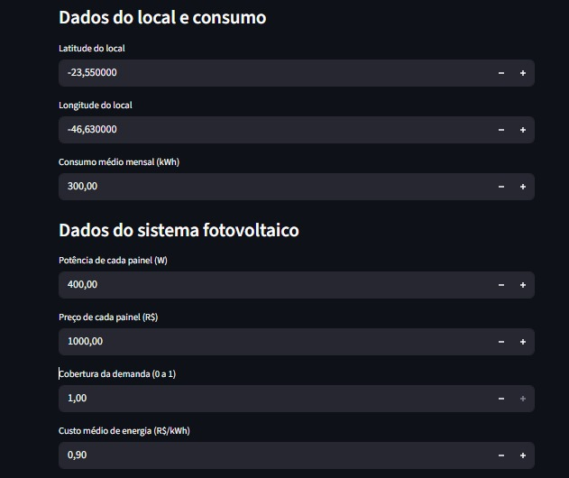
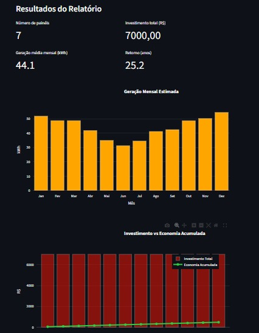

# Simulador de Sistema Solar Fotovoltaico 

Este projeto é um **simulador de sistemas fotovoltaicos** desenvolvido em Python com **Streamlit** para interface web, **Plotly** para gráficos interativos e **FPDF** para geração de relatórios em PDF.  

O objetivo é calcular:

- Número de painéis necessários para atender determinada demanda de energia.  
- Geração mensal estimada em kWh.  
- Investimento total e payback do sistema.  

---

## Tecnologias e Bibliotecas

- Python 3.11+  
- [Streamlit](https://streamlit.io/) – Interface web interativa  
- [Plotly](https://plotly.com/python/) – Gráficos interativos  
- [FPDF](https://pyfpdf.github.io/fpdf2/) – Geração de PDFs  
- [Requests](https://docs.python-requests.org/) – Consulta à API NASA POWER  

---

## Estrutura do Projeto
```
Simulador-Sistema-Fotovoltaico/
├─ app/ # Interface web e gráficos
│ ├─ plots/ # Gráficos gerados automaticamente
│ └─ ui_streamlit.py # Interface web Streamlit
├─ core/ # Lógica e cálculos
│ ├─ __init__.py
│ ├─ calculations.py # Cálculos do sistema
│ └─ utils.py # Consultas à API NASA POWER
├─ data - clima/
│ └─ irradiance_sample.csv # Dados de exemplo
├─ main.py # Execução em terminal (opcional)
├─ requirements.txt # Dependências
└─ README.md # Este arquivo
```


---

## Como Rodar

### 1. Clonar o repositório

```bash
git clone https://github.com/Vinicius01/Simulador-Solar-Fotovoltaico.git
cd Simulador-Solar-Fotovoltaico
pip install -r requirements.txt
streamlit run app/ui_streamlit.py
```

## Imagens do Projeto



